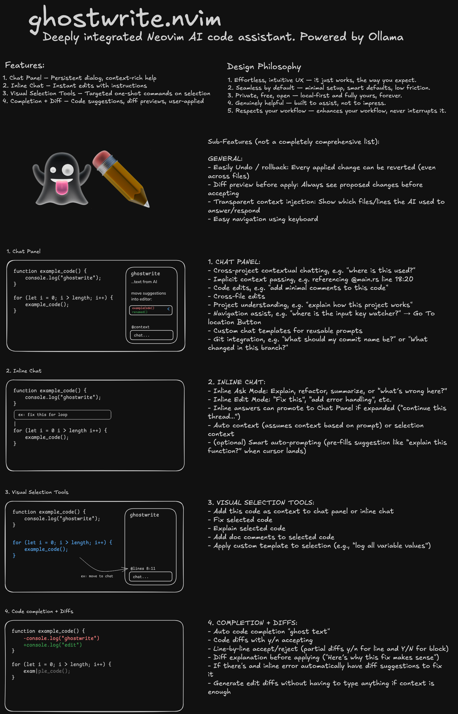

# 👻 ghostwrite.nvim

**🚧 WIP – deeply integrated AI assistant for Neovim.**  
Powered by Ollama. Local-first (offline + private + free). Keyboard-native.

**🎯 Projected Release Date: March 1, 2025**

---

**✅ Progress:** Finalized plugin plan, Plugin boilerplate, Inline popup (UI only), Chat panel (UI only).

**⏳ Todo:** Visual selection interaction, Code diff UI, Code completion UI, Create Rust project, Ollama Rust integration, Rust to UI bridge, and more.

---

## ⭐️ Planning Notes:

