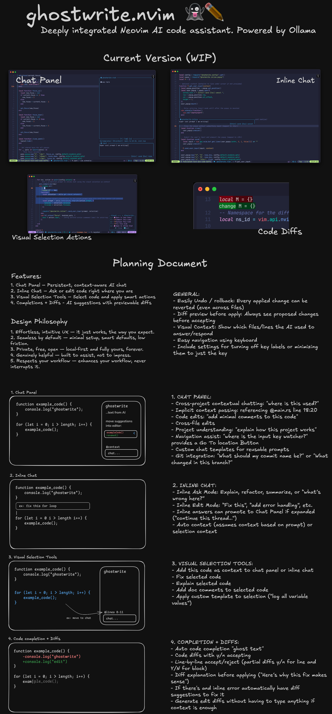

# 👻 ghostwrite.nvim

**WIP – deeply integrated AI assistant for Neovim.**  
Powered by Ollama. Local-first (offline + private + free). Keyboard-native.

## Progress:
- Finalized plugin plan
- Plugin boilerplate
- Inline-ghostwrite inline popup (UI only)

## Planning:

